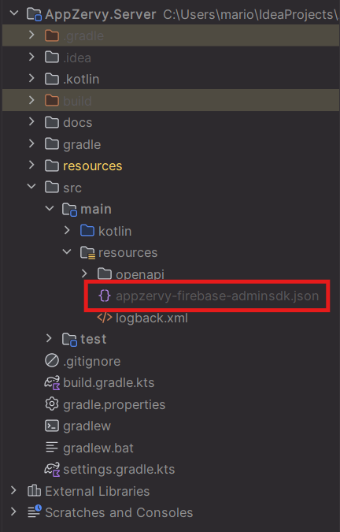
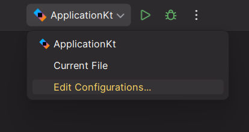

# GUIA DE EJECUCION - APP ZERVY (SERVER)

### Instroduccion: 
Zervy (Server) es el proyecto oficial para desarrollar el apartado de la api de consumo de la app, y contendra todos los metoodos y clases necesarias para la logica del negocio.

<br>

## Lenguajes utilizados

> ### Ktor


> ### Firebase


<br>

## Intrucciones para ejecucion del proyecto
> [!WARNING]
> Asegurate de seguir paso a paso el instructivo, de no ser asi, podria no funcionar la compilacion del proyecto

<br>

> ### Paso 1: Agregar clave privada
Agregar la clave privada llamada "appzervy-firebase-adminsdk.json" a la zona donde se muestra en la imagen



<br>

> ### Paso 2: Revisar el compilador
Accedemos primero en la parte superior donde este el ApplicationKt



y luego verificamos que posea el sdk en su version 11 para el "JRE" y que el classpath este dirigido al main


<br>

> ### Paso 3: Ejecutar proyecto y probar

Comprobar el funcionamiento del proyecto, realizando peticiones en postman.
Ademas existe un archivo dentro del proyecto el cual posee el formato de las peticiones, para solo ejecutarlas rapidamente en postman
 - Esta es la ruta del archivo: src/main/kotlin/com/example/routes/Formato de consultas

<br>

## Estructura del proyecto

<br>

> ### Primer apartado: FirebaseInicialized.kt
En este archivo se encuentra la configuracion de firebase, y la inyeccion de datos a la interfaz y clase de clientes

``` kotlin

val appModule = module {

    // Proveedor del Firestore
    single<Firestore> {

        // Inicializar Firebase si no está inicializado
        if (FirebaseApp.getApps().isEmpty()) {
            val serviceAccount = this::class.java.getResourceAsStream("/appzervy-firebase-adminsdk.json")
                ?: throw IllegalStateException("No se pudo encontrar el archivo de credenciales de Firebase.")

            val options = FirebaseOptions.builder()
                .setCredentials(GoogleCredentials.fromStream(serviceAccount))
                .setProjectId("appzervy")
                .build()

            FirebaseApp.initializeApp(options)
        }
        FirestoreClient.getFirestore()
    }

    // Proveedor del ClienteService
    single<IClienteRepostory> { ClienteRepository(get()) }
}

```

<br>

> ### Segundo apartado: Application.kt
En este archivo se encuentra la implementacion de todos los archivos o clases necesarias para la compilacion del proyecto

``` kotlin

fun main() {
    embeddedServer(Netty, port = 8080, host = "127.0.0.1", module = Application::module)
        .start(wait = true)
}

fun Application.module() {

    install(Koin) {
        slf4jLogger()
        modules(appModule)
    }

    //configuracion de rutas
    configureRouting()

    //extras
    configureHTTP()
    configureSerialization()
}

```

<br>

> ### Tercer apartado: Clase Cliente (models)
En esta clase se encuentran los campos del cliente, necesarios para realiza code first

``` kotlin

@Serializable
data class Cliente(
    val idCliente: String? = null,
    val nombres: String = "",
    val celular: String = "",
    val correo: String = "",
    val contraseña: String = "",
    val foto: String = "",
    val dui: String = ""
)

```

<br>

> ### Cuarto apartado: Routing.kt (plugins)
En este archivo, se encuentran las rutas las cuales luego se mandan a llamar por medio de la instancia "configureRouting()" en el "Application.kt"
Ademas en este archivo se pueden implementar los metodos rest, para la ejecucion del crud, pero lo haremos de manera mas ordenada, inyectando el repositorio y pasandolo al archivo clienteRouting.kt

``` kotlin

fun Application.configureRouting() {

    val _repository by inject<IClienteRepostory>()

    routing {

        get("/") {
            call.respondText("Vale verga este texto xd")
        }

        //llamada de funcion(controlador) del cliente
        clienteRouting(_repository)

    }
}

```

<br>

> ### Quinto apartado: ClienteRoute.kt (routes)
En este archivo, se encuentran las ejecuciones de las peticiones del repositorio, exclusivamente para el modelo de clientes, basicamente este archivo funciona como un controlador, ya que en ktor no se les llama controllers, si no rutas.
Ademas el archivo pide el repositorio como parametro, el cual hemos mandado desde Routing.kt

``` kotlin

fun Route.clienteRouting(_repository: IClienteRepostory) {

    route("/clientes") {

        // Crear un nuevo cliente
        post("/crearCliente") {

            val cliente = call.receive<Cliente>()
            val nuevoCliente = _repository.crearCliente(cliente)
            call.respond(HttpStatusCode.Created, nuevoCliente)
        }

        // Obtener todos los clientes
        get("/obtenerClientes") {

            val obtenerClientes = _repository.obtenerClientes()
            call.respond(obtenerClientes)
        }

        // Obtener un cliente por ID
        get("/obtenerClienteId/{id}") {

            val id = call.parameters["id"]

            if (id != null) {

                val cliente = _repository.obtenerClientePorId(id)

                if (cliente != null) {
                    call.respond(cliente)
                } else {
                    call.respond(HttpStatusCode.NotFound, "Cliente no encontrado")
                }

            } else {
                call.respond(HttpStatusCode.BadRequest, "ID de cliente no proporcionado")
            }
        }

        // Actualizar un cliente
        put("/actualizarCliente") {

            val cliente = call.receive<Cliente>()

            val id = cliente.idCliente

            if (id != null) {

                val actualizado = _repository.actualizarCliente(id, cliente)

                if (actualizado) {
                    call.respond(HttpStatusCode.OK, "Cliente actualizado")
                } else {
                    call.respond(HttpStatusCode.NotFound, "Cliente no encontrado")
                }

            } else {
                call.respond(HttpStatusCode.BadRequest, "ID de cliente no proporcionado")
            }
        }

        // Eliminar un cliente
        delete("/eliminarCiente") {

            val data = call.receive<Map<String, String>>()

            val id = data["idCliente"]

            if (id != null) {

                val eliminado = _repository.eliminarCliente(id)

                if (eliminado) {
                    call.respond(HttpStatusCode.OK, "Cliente eliminado")
                } else {
                    call.respond(HttpStatusCode.NotFound, "Cliente no encontrado")
                }

            } else {
                call.respond(HttpStatusCode.BadRequest, "ID de cliente no proporcionado")
            }
        }
    }
}

```

<br>

> ### Sexto apartado: Interface IClienteRepository (repository)
Ahora retrocederemos un poco, para mostrar la interfaz del cliente para el repositorio, y tambien para realizar correctamente la inyeccion de dependencias.

``` kotlin

interface IClienteRepostory {

    suspend fun crearCliente(cliente: Cliente): Cliente
    suspend fun obtenerClientes(): List<Cliente>
    suspend fun obtenerClientePorId(id: String): Cliente?
    suspend fun actualizarCliente(id: String, cliente: Cliente): Boolean
    suspend fun eliminarCliente(id: String): Boolean
}

```

<br>

> ### Septimo apartado: Clase ClienteRepository (repository)
Dentro de la clase del cliente para el repositorio, tenemos la implementacion de la interfaz de cliente, y la creacion de los metodos (peticiones) del crud, y ademas tenemos un proceso de corrutinas, para ejecutar aun mas en tiempo real dichas peticiones el cual es ApiFuture<T>

``` kotlin

// Función de extensión para ApiFuture<T>
    suspend fun <T> ApiFuture<T>.await(): T = suspendCancellableCoroutine { cont ->
        ApiFutures.addCallback(this, object : ApiFutureCallback<T> {
            override fun onSuccess(result: T) {
                if (cont.isActive) {
                    cont.resume(result)
                }
            }

            override fun onFailure(t: Throwable) {
                if (cont.isActive) {
                    cont.resumeWithException(t)
                }
            }
        }, Runnable::run)
    }

    override suspend fun crearCliente(cliente: Cliente): Cliente {

        val docRef = firestore.collection("clientes").document()
        val nuevoCliente = cliente.copy(idCliente = docRef.id)
        docRef.set(nuevoCliente).await()
        return nuevoCliente
    }

    override suspend fun obtenerClientes(): List<Cliente> {

        val snapshot = firestore.collection("clientes").get().await()
        return snapshot.documents.mapNotNull { document ->
            document.toObject(Cliente::class.java)?.copy(idCliente = document.id)
        }
    }

    override suspend fun obtenerClientePorId(id: String): Cliente? {

        val doc = firestore.collection("clientes").document(id).get().await()
        return if (doc.exists()) {
            doc.toObject(Cliente::class.java)?.copy(idCliente = doc.id)
        } else {
            null
        }
    }

    override suspend fun actualizarCliente(id: String, cliente: Cliente): Boolean {

        val docRef = firestore.collection("clientes").document(id)
        val updatedCliente = cliente.copy(idCliente = id)
        docRef.set(updatedCliente).await()
        return true
    }

    override suspend fun eliminarCliente(id: String): Boolean {

        firestore.collection("clientes").document(id).delete().await()
        return true
    }

```

<br>

## Conclusiones del proyecto
Con todo lo enseñado en este archivo, es mas que suficiente para comprender el funcionamiento y realizacion de una api basica en ktor con firebase


